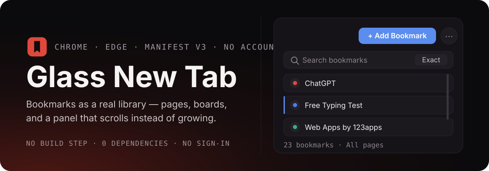
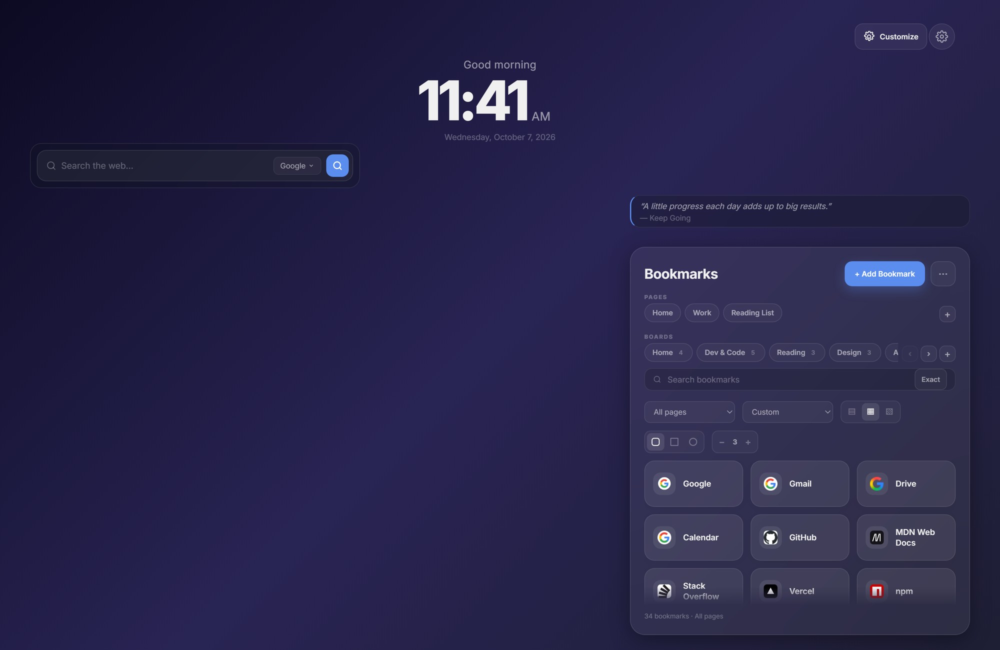
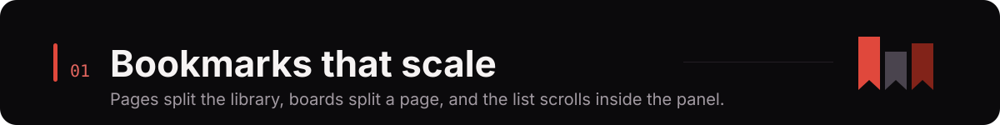
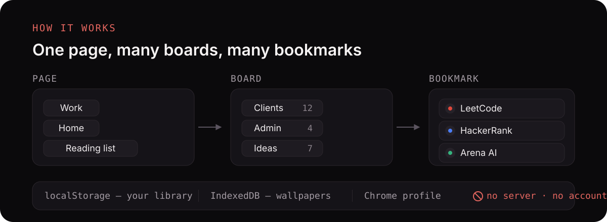
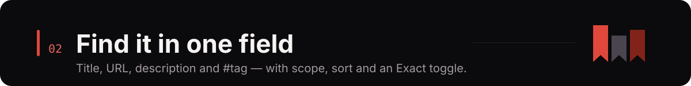
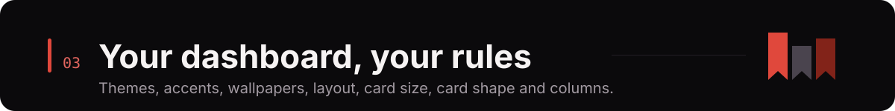
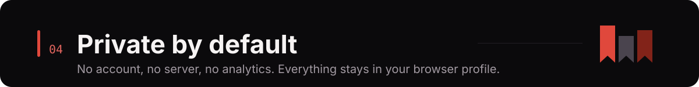
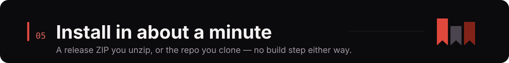

<p align="center">
  
</p>

<p align="center">
  <a href="releases/glass-new-tab-v1.3.0.zip"></a>
  
  
  
  
  
</p>

<p align="center">
  <b>Install</b> ·
  <a href="#bookmarks-that-scale">Features</a> ·
  <a href="#screenshots">Screenshots</a> ·
  <a href="#keyboard-shortcuts">Shortcuts</a> ·
  <a href="#files">Files</a> ·
  <a href="#brand">Brand</a> ·
  <a href="#faq">FAQ</a>
</p>

A new tab that treats bookmarks as a small **library** instead of a list. A **page** groups your
context — Work, Home, Reading list. A **board** groups things inside that page. The panel
**scrolls inside itself**, so a hundred saved links read as calmly as ten, and nothing ever spills
onto your wallpaper.

No account. No server. No analytics. Everything lives in your own browser profile, and the only
network requests are the ones you ask for — a search suggestion, a favicon.

<p align="center">
  
  <br>
  <sub>Real install, real library, your wallpaper — the panel holds the list, the page keeps its shape.</sub>
</p>

<!--
  SECTION 01 — BOOKMARKS
-->

<p align="center">
  
</p>

### Pages, boards, and a list that scrolls

| | |
|---|---|
| **Pages** | Split the library by context. Create, rename (click a pill and right-click, or use the menu) and delete pages without disturbing their neighbours. |
| **Boards** | Ten boards ship built-in on a fresh install, each showing its own count. Duplicate URLs are refused **inside one board**, so tidy stays tidy. |
| **Scrolling panel** | The list scrolls **inside** the panel with an always-reserved, opaque scrollbar. A resized panel can never spill cards onto the page, and 500 bookmarks behave like 10. |
| **Scrolling pill rows** | Pages and boards scroll by wheel, by `‹` `›` buttons that appear only while a row overflows, or as compact drop-downs. The `+` pill adds one on the spot. |
| **Drag and drop** | Drag a bookmark to another board, or to another page entirely. Reorder Favorites the same way. |
| **Favorites, Trash, Undo** | Star what matters, delete into a **30-day Trash** you can restore from, and step through changes with `Ctrl`/`⌘`+`Z` / `Ctrl`/`⌘`+`Shift`+`Z`. |
| **Import / export** | JSON backup, Netscape HTML or CSV — out and back in again. Or pull in **Chrome's own bookmarks** in one click. |
| **Quick save** | Hit `Ctrl`/`⌘`+`Shift`+`Y`, click the toolbar button, or right-click → *Save to Glass New Tab*. Title, URL and description arrive pre-filled. |
| **Privacy mode** | Blur every bookmark title until you hover, for a new tab you can open in a meeting. |
| **Live counts** | A quiet line under the list — `23 bookmarks · All pages` — so a scrolled list never reads as a lost one. |

### How a library is built

<p align="center">
  
</p>

A page owns its boards, and a board owns its bookmarks. *Work* and *Home* can each hold a board
called *Clients* without ever interfering, because nothing is shared behind the scenes. The whole
workspace is one record in your profile's `localStorage`; uploaded video wallpapers go to
`IndexedDB`. Nothing leaves the machine, which is also why there is nothing to sign in to.

<!--
  SECTION 02 — FIND
-->

<p align="center">
  
</p>

One field searches **titles, URLs, descriptions and `#tags`**, and the **Exact** toggle switches it
from loose matching to field-exact matching when a fuzzy hit list is not what you want.

| Control | Options |
|---|---|
| **Scope** | All pages · This page · This board · Favorites · Recently visited |
| **Sort** | Custom · Recently Added · A–Z · Most Used *(usage counted locally, per bookmark)* |
| **Layout** | Grid of cards · Vertical list · Compact list |
| **Card size** | Compact · Medium · Large |
| **Card shape** | Soft rounded · Squared-off · Capsule |
| **Columns** | A 2–6 stepper, with sliders for transparency, blur, radius and icon size in Settings |

Every one of those choices is remembered, and the same controls are mirrored by sliders in
Settings for the ones with a range.

<!--
  SECTION 03 — MAKE IT YOURS
-->

<p align="center">
  
</p>

| | |
|---|---|
| **Themes** | Light, Glass and Dark, applied to the dashboard, the cards and every modal. |
| **Accents** | Eight accent colours — blue, green, yellow, purple, orange, teal, pink, red — wired through buttons, pills, focus rings and the active card edge. |
| **Backgrounds** | Any image or a looping video, stored locally in `IndexedDB`. Nothing is uploaded anywhere. |
| **Freeform layout** | Press **Customize**, then drag widgets anywhere and pull an edge or corner to resize. Arrangements are remembered **per screen-size class** (compact / wide / large), so a laptop layout never fights a monitor one. |
| **Controls for all of it** | Auto-arrange toggle, widget shapes (soft, square, capsule), arrow-key resizing with `Shift` to move, and a reset that clears the arrangement and nothing else. |
| **Clock & quote** | 12/24-hour clock with live seconds and a greeting that follows the day; a quote of the day from the built-in library, from lines you type yourself, or from both — selectable and shuffleable. |
| **Search engines** | Google, Bing, DuckDuckGo, Brave, Yahoo, Ecosia, or your own `%s` URL template, with live suggestions and `Ctrl`/`⌘`+`K` to focus. |
| **Widgets** | Show or hide the clock, search, quote and either bookmark keeper independently. |

<!--
  SECTION 04 — PRIVACY
-->

<p align="center">
  
</p>

- **No account, no sign-in, no analytics, no telemetry, no remote code.**
- Bookmarks, pages, boards, layout, theme and preferences live in `localStorage`; background
  media lives in `IndexedDB` — all under your own Chrome profile.
- The only outbound requests are search suggestions for the engine you picked and the favicon
  images for your own bookmarks. Block either and the extension still works, falling back to a
  letter in place of a favicon.
- `bookmarks` is an **optional** permission, requested only when you press *Import Chrome*.
- Uninstalling removes the data with it. **⋯ → Export backup** gives you a JSON file you can
  inspect, keep, or import later.

<!--
  SECTION 05 — INSTALL
-->

<p align="center">
  
</p>

### 1. From the release ZIP — no terminal

1. Download **[`releases/glass-new-tab-v1.3.0.zip`](releases/glass-new-tab-v1.3.0.zip)**
2. **Unzip it.** You get a folder called `glass-new-tab` with `manifest.json` inside.
3. Open `chrome://extensions` (or `edge://extensions`).
4. Turn on **Developer mode** — top right corner.
5. Click **Load unpacked** and pick that `glass-new-tab` folder.
6. Open a new tab. Done.

### 2. From a clone — to read or change the code

```bash
git clone https://github.com/tejasrajm46-strix/awesome_chrome_extension.git
```

Then `chrome://extensions` → **Developer mode** → **Load unpacked** → choose the cloned folder.
The repository root *is* the extension: `manifest.json`, `newtab.html`, `css/`, `js/` and
`assets/` all sit at the top level. There is nothing to build and no `npm install`.

> **After editing any file**, press the reload ↻ button on the extension card, then reload the new
> tab page. Plain ES5 JavaScript and plain CSS — no bundler, no framework, no dependencies.

---

## Screenshots

### First run

<p align="center">
  
  <br>
  <sub>One page, ten boards ready, six starter bookmarks — nothing to configure before you start.</sub>
</p>

### The panel, up close

<p align="center">
  
  <br>
  <sub>Pages, boards with counts, search with scope and sort, and the card size / shape / column controls.</sub>
</p>

### Your own background, your own layout

<p align="center">
  
  <br>
  <sub>An image of your own — stored locally, never uploaded — with the widgets dragged wherever you like them.</sub>
</p>

---

## Keyboard shortcuts

| Keys | Does |
|---|---|
| `Ctrl`/`⌘` + `K` | Focus the bookmark search |
| `Ctrl`/`⌘` + `B` | Jump to Favorites |
| `Ctrl`/`⌘` + `Z` | Undo |
| `Ctrl`/`⌘` + `Shift` + `Z` | Redo |
| `Ctrl`/`⌘` + `Shift` + `Y` | Quick-save the page you are on |
| `←` `→` `Home` `End` | Move between page and board pills |
| `↑` `↓` `←` `→` in Customize | Resize the selected widget — hold `Shift` to move it |
| `Esc` | Close a modal, or leave Customize mode |

---

## Files

```
awesome_chrome_extension/
├── manifest.json                 Manifest V3 — name, permissions, icons, new-tab override
├── newtab.html                   The dashboard markup — the only page
├── css/
│   └── style.css                 Themes, glass, cards, layout and responsive rules
├── js/
│   ├── storage.js                localStorage + IndexedDB wrappers
│   ├── layout.js                 Freeform widget layout: move, resize, snapping, size classes
│   ├── background.js             Wallpaper upload / video / reset
│   ├── clock.js                  Clock and greeting
│   ├── search.js                 Search engines, suggestions, custom URL templates
│   ├── bookmarks.js              First-run seed data
│   ├── workspace.js              Pages, boards, cards, search, sort, import/export, Trash
│   ├── settings.js               Settings panel and appearance preferences
│   ├── app.js                    Boot sequence, quote of the day, onboarding
│   └── service-worker.js         Context menus, toolbar button, quick-save tab
├── assets/
│   ├── icons/                    Extension icons 16 / 32 / 48 / 128 px
│   ├── brand/                    Logo SVG variants and PNG exports
│   └── readme/                   The hero, section headers and diagram used by this README
├── docs/                         Screenshots, banners and the palette used in this README
└── releases/
    └── glass-new-tab-v1.3.0.zip  The packaged extension, ready to unzip and load
```

---

## Brand

<p align="center">
  
</p>

The mark is one shape in one colour: a rounded tile with a **bookmark cut clean through it**. The
bookmark is a real hole, not a white shape drawn on top — which is why the same file works on
light, dark, photographic and one-colour backgrounds, and why it still reads at 16 px in a browser
toolbar without smudging.

<p align="center">
  
</p>

| Name | HEX | Where it is used |
|---|---|---|
| Red 100 | `#E4665F` | Tints, hover states, badges, dark-mode accents |
| Red 300 | `#E0483C` | **Primary** — the mark, headings, the main call to action |
| Red 600 | `#BA362A` | Pressed states, deeper accents, kickers |
| Red 900 | `#822319` | Ink, rules, dark surfaces |

Red carries the energy the product is about, and keeps the mark clear of the blue that nearly
every bookmark and tab manager reaches for. The dashboard's own accent colour is yours to change
in Settings; the palette above is the brand layer — the logo, this README and the project artwork.
Type is the **system UI font**, so the dashboard is set in your operating
system's own type and no font is ever fetched over the network.

<details>
<summary><b>Logo files in the repository</b></summary>

| File | Use |
|---|---|
| `assets/brand/glass-new-tab-logo.svg` | Master mark, brand red, with clear space |
| `assets/brand/glass-new-tab-logo-tight.svg` | Tight variant — used for the toolbar icons |
| `assets/brand/glass-new-tab-logo-black.svg` / `…-white.svg` | One-colour versions for print and dark backgrounds |
| `assets/brand/glass-new-tab-logo-mono-red.svg` | One-colour in the deep red |
| `assets/brand/glass-new-tab-app-icon.svg`, `…-square.svg` | Store, avatar and social masters |
| `assets/brand/png/` | PNG exports at 512 px |
| `assets/readme/` | Hero, section headers and the diagram, hand-authored SVG |
| `docs/logo-concepts.png` | The three concepts this mark was chosen from, at real sizes |

</details>

---

## Permissions, and why

| Permission | Why |
|---|---|
| `storage` | Your bookmarks, layout, theme and preferences — locally. |
| `tabs` | To open a saved bookmark in a new tab, and to quick-save the page you are on. |
| `contextMenus` | The right-click *Save to Glass New Tab* item. |
| `bookmarks` *(optional)* | Requested only when you press *Import Chrome*. Decline and everything else still works. |
| `host_permissions` (search engines + `google.com/s2/favicons`) | Fetch search suggestions for the engine you picked, and draw favicons for your own bookmarks. |

---

## FAQ

<details>
<summary><b>Where is my data?</b></summary>

In your Chrome profile: `localStorage` for bookmarks, pages, boards, layout and preferences,
`IndexedDB` for uploaded video wallpapers. Uninstalling the extension removes it. Use
**⋯ → Export backup** for a JSON file you can keep or inspect.
</details>

<details>
<summary><b>My bookmarks look empty after switching to a new profile or browser.</b></summary>

Chrome profiles have separate storage. Import a JSON backup with **⋯ → Import file**, or
**⋯ → Import Chrome** to pull the current profile's bookmarks in.
</details>

<details>
<summary><b>Favicons are showing as letters instead of icons.</b></summary>

Favicons come from Google's favicon service, which needs network access and the host permission
above. Offline, or with the permission removed, the card falls back to the first letter of the
title — by design, never a broken image.
</details>

<details>
<summary><b>Do pages and boards share bookmarks?</b></summary>

No. A page owns its boards and its bookmarks, so *Work* and *Home* can both hold a board called
*Clients* without interfering. Duplicate URLs are refused **within one board**.
</details>

<details>
<summary><b>Can I get the whole library on one screen?</b></summary>

Search with the scope set to **All pages**, or raise the column stepper to 5–6, or switch the
layout to **Compact list** — the list scrolls inside the panel rather than growing the page.
</details>

<details>
<summary><b>How many bookmarks can it hold?</b></summary>

The panel is built to scroll, so the practical limit is your `localStorage` budget rather than the
layout: thousands of entries stay navigable with search, scope and sort.
</details>

---

## Known limitations

Honest list, so nothing surprises you:

- **No sync.** Bookmarks live in one browser profile; export/import is the bridge.
- **Titles truncate at 4+ columns in a narrow panel.** The panel is a fraction of your screen; keep
  it narrow and use 2–3 columns for full titles, or switch to list layout.
- **Layout is per screen-size class**, so a window dragged between size classes is re-arranged
  from that class's profile rather than scaled.
- **Keyboard navigation stops at the pill rows** — cards are reachable with `Tab`, but there is no
  arrow-key traversal inside the grid yet.
- Chrome only exposes *Allow in incognito* to extensions you enable it for; the incognito open
  option will tell you if it is off.

---

## Contributing

Issues and pull requests are welcome. There is no build step: edit `js/` or `css/`, reload the
extension card in `chrome://extensions`, reload the new tab. If you change behaviour, say in the
PR what you loaded it in and what you saw — a screenshot of the panel is the easiest review.

---

<p align="center">
  
  <br>
  <b>Glass New Tab</b> — bookmark pages and boards for your new tab.
  <br>
  <sub>MIT licensed · System UI type · no fonts fetched</sub>
</p>
