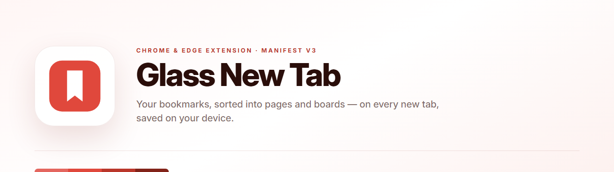
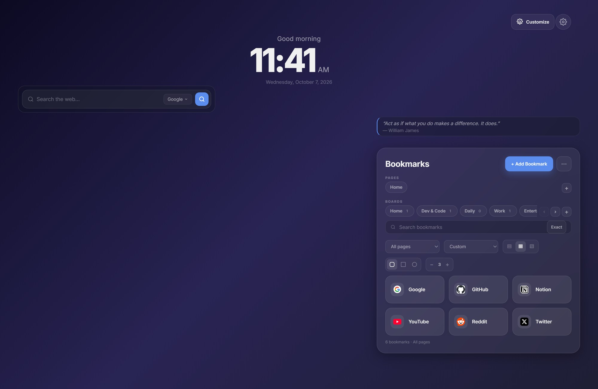
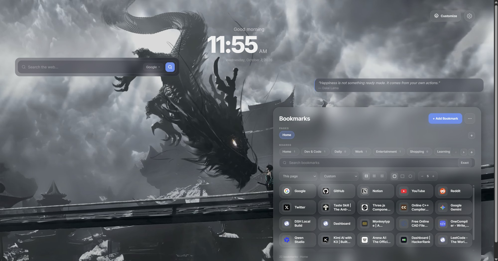
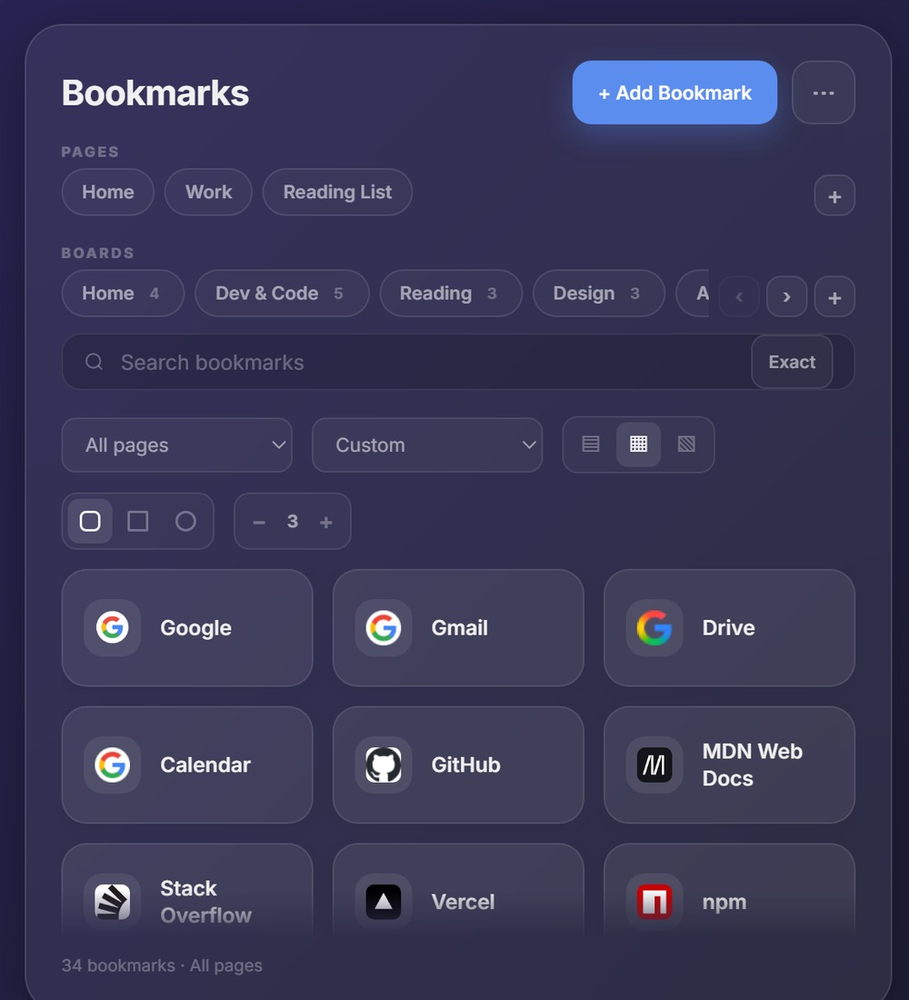
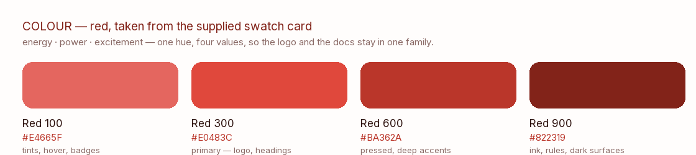

<div align="center">

<picture>
  <source media="(prefers-color-scheme: dark)" srcset="docs/banner-dark.png" />
  
</picture>

<br />

**Every new tab, your bookmarks — sorted into pages and boards, saved on your device.**

[](manifest.json)
[](manifest.json)
[](#install)
[](LICENSE)
[](#privacy)

[Install](#install) · [Features](#features) · [Screenshots](#screenshots) · [Shortcuts](#keyboard-shortcuts) · [Brand](#brand) · [FAQ](#faq)

</div>

---

A new tab page that treats bookmarks as a small library instead of a list. Bookmark
**pages** group your work, **boards** group them inside a page, and the panel scrolls
however many you keep — a hundred bookmarks stay as usable as ten. Everything lives in
your browser's own storage: no account, no server, no analytics.

---

## Install

Two ways in. Both take about thirty seconds.

### 1. From the release ZIP (no terminal)

1. Download **[`releases/glass-new-tab-v1.3.0.zip`](releases/glass-new-tab-v1.3.0.zip)**
2. **Unzip it.** You get a folder called `glass-new-tab` with `manifest.json` inside.
3. Open `chrome://extensions` (or `edge://extensions`).
4. Turn on **Developer mode** — top right corner.
5. Click **Load unpacked** and pick the unzipped `glass-new-tab` folder.
6. Open a new tab. Done.

### 2. From a clone (to read or change the code)

```bash
git clone https://github.com/tejasrajm46-strix/awesome_chrome_extension.git
```

Then `chrome://extensions` → **Developer mode** → **Load unpacked** → choose the cloned
folder. The repository root *is* the extension: `manifest.json`, `newtab.html`, `css/`,
`js/` and `assets/` are all at the top level, so there is nothing to build and no
`npm install` step.

> **After editing any file**, press the reload ↻ button on the extension card, then
> reload the new tab page. The extension is plain ES5 JavaScript and plain CSS — no
> bundler, no framework, no dependencies.

---

## Features

### 🗂️ Bookmarks that scale

| | |
|---|---|
| **Pages** | Split the library by context — Home, Work, Reading List. Create, rename (right-click a pill) and delete them without touching their neighbours. |
| **Boards** | Ten boards ship built-in per page, each showing its own bookmark count. Right-click to rename or delete. |
| **Scrolling panel** | The bookmark list scrolls **inside** the panel, so a library of 500 behaves like one of 10 — and a panel you resized by hand can never spill its cards onto the page. |
| **Scrolling page and board rows** | Never a clipped pill: the rows scroll with the wheel and with `‹` `›` buttons that appear only while they overflow. The `+` pill adds a page or a board on the spot. |
| **Search** | Filter by title, URL, description and #tag, with an **Exact** toggle for field-exact matching. Scope it to All pages, This page, This board, Favorites or Recently visited. |
| **Sort** | Custom order, Recently Added, A–Z or Most Used (per-bookmark usage is counted locally). |
| **Cards your way** | Three sizes, three shapes — rounded, squared-off or capsule — and a 2–6 column stepper, all in the toolbar and mirrored by the sliders in Settings. |
| **Drag and drop** | Move a bookmark between boards or between pages, and reorder Favorites by dragging. |
| **Favorites, Trash, Undo** | Star a bookmark, delete to a 30-day Trash you can restore from, and step back through `Ctrl`/`⌘`+`Z` (with redo). |
| **Import / export** | Export JSON backup, Netscape HTML or CSV; import any of those, or import straight from Chrome's own bookmarks. |
| **Quick save** | One keystroke (`Ctrl`/`⌘`+`Shift`+`Y`), the toolbar button, or a right-click → *Save to Glass New Tab*. |
| **Privacy mode** | Blur every bookmark title until you hover. |
| **Live counts** | A quiet line under the list — `34 bookmarks · All pages` — so a scrolled list never reads as a lost one. |

### 🕐 Around the bookmarks

| | |
|---|---|
| **Clock** | 12/24-hour, live seconds, and a greeting that follows the day. |
| **Search** | Google, Bing, DuckDuckGo, Brave, Yahoo, Ecosia or your own URL template, with live suggestions and `Ctrl`/`⌘`+`K` to focus. |
| **Quote** | One line a day, rotating from a local list — no network call. |

### 🎨 Make it yours

- **Themes** — Light, Glass and Dark.
- **Eight accent colours**, applied across the whole dashboard.
- **Backgrounds** — any image or a looping video, stored locally in IndexedDB (no upload).
- **Freeform layout** — hit **Customize**, then drag widgets anywhere and pull their
  edges or corners to resize. Arrangements are remembered **per screen size class**
  (compact / wide / large), so a laptop layout never fights a monitor one. There is an
  auto-arrange toggle, widget shapes (soft, square, capsule), keyboard resizing with the
  arrow keys, and a reset that clears the arrangement and nothing else.

### 🔒 Privacy

- No account, no sign-in, no analytics, no telemetry, no remote code.
- Everything — bookmarks, layout, theme, background — is in `localStorage` / IndexedDB
  on your machine, under your Chrome profile.
- The only network requests are the ones you ask for: search suggestions, favicon images
  for your own bookmarks, and the UI font. Block any of them and the extension still
  works, with a letter fallback in place of favicons.
- `bookmarks` is an **optional** permission, requested only when you press *Import Chrome*.

---

## Screenshots

### First run

<div align="center">
  
  <sub>What a fresh install shows — ten boards ready, six starter bookmarks, nothing to configure.</sub>
</div>

### Your own background, your own layout

<div align="center">
  
  <sub>An image of your own — stored locally, never uploaded — with the widgets dragged wherever you like them.</sub>
</div>

### The panel, up close

<div align="center">
  
  <sub>Pages, boards with counts, search with scope and sort, and the card size / shape / column controls.</sub>
</div>

---

## Keyboard shortcuts

| Keys | Does |
|---|---|
| `Ctrl`/`⌘` + `K` | Focus the bookmark search |
| `Ctrl`/`⌘` + `B` | Jump to Favorites |
| `Ctrl`/`⌘` + `Z` | Undo |
| `Ctrl`/`⌘` + `Shift` + `Z` | Redo |
| `Ctrl`/`⌘` + `Shift` + `Y` | Quick-save the page you are on |
| `←` `→` `Home` `End` | Move between page and board pills |
| `↑` `↓` `←` `→` (Customize mode) | Resize the selected widget; hold `Shift` to move it |
| `Esc` | Close a modal, leave Customize mode |

---

## Files

```
awesome_chrome_extension/
├── manifest.json              Manifest V3: name, permissions, icons, new-tab override
├── newtab.html                The dashboard markup — the only page
├── css/
│   └── style.css              All styling: themes, glass, cards, layout, responsive rules
├── js/
│   ├── storage.js             localStorage + IndexedDB wrappers
│   ├── layout.js              Freeform widget layout: move, resize, snapping, size classes
│   ├── background.js          Wallpaper upload / video / reset
│   ├── clock.js               Clock and greeting
│   ├── search.js              Search engines, suggestions, custom URL templates
│   ├── bookmarks.js           First-run seed data
│   ├── workspace.js           Pages, boards, cards, search, sort, import/export, Trash
│   ├── settings.js            Settings panel and appearance preferences
│   ├── app.js                 Boot sequence
│   └── service-worker.js      Context menus, toolbar button, quick-save tab
├── assets/
│   ├── icons/                 Extension icons 16 / 32 / 48 / 128 px
│   └── brand/                 Logo SVG variants and PNG exports
├── docs/                      Screenshots, banners and the palette used in this README
└── releases/
    └── glass-new-tab-v1.3.0.zip   The same extension, ready to unzip and load
```

---

## Brand

<div align="center">
  
</div>

The mark is one shape in one colour: a rounded tile with a **bookmark cut clean through
it**. The bookmark is a real hole, not a white shape drawn on top — which is why the same
file works on light, dark, photographic and one-colour backgrounds, and why it reads at
16 px in a browser toolbar without turning into a smudge.

<div align="center">
  
</div>

| Name | HEX | Where it is used |
|---|---|---|
| Red 100 | `#E4665F` | Tints, hover states, badges, dark-mode accents |
| Red 300 | `#E0483C` | **Primary** — the mark, headings, the main call to action |
| Red 600 | `#BA362A` | Pressed states, deeper accents, kickers |
| Red 900 | `#822319` | Ink, rules, dark surfaces |

Red carries the meaning the brief asked for — energy, power, excitement — and it keeps
the mark clear of the blue that nearly every bookmark and tab manager reaches for. The
dashboard's own accent colour is yours to change in Settings; the palette above is the
brand layer: the logo, this README and the project's artwork.

Type is **Inter** (SIL Open Font License). The mark was designed with a logo-design
skill's process rather than by taste alone: three concepts explored in one colour, tested
at 16 / 32 / 48 / 128 px and on dark, the weakest two discarded, then the survivor built
out into a variant set.

<details>
<summary><b>Logo files in the repository</b></summary>

| File | Use |
|---|---|
| `assets/brand/glass-new-tab-logo.svg` | Master mark, brand red, with clear space |
| `assets/brand/glass-new-tab-logo-tight.svg` | Tight variant — used for the toolbar icons |
| `assets/brand/glass-new-tab-logo-black.svg` / `…-white.svg` | One-colour versions for print and dark backgrounds |
| `assets/brand/glass-new-tab-logo-mono-red.svg` | One-colour in the deep red |
| `assets/brand/glass-new-tab-app-icon.svg`, `…-square.svg` | Store, avatar and social masters |
| `assets/brand/png/` | PNG exports at 512 px |
| `docs/logo-concepts.png` | The three concepts this mark was chosen from, at real sizes |

</details>

---

## Permissions, and why

| Permission | Why |
|---|---|
| `storage` | Your bookmarks, layout, theme and preferences — locally. |
| `tabs` | To open a saved bookmark in a new tab, and to quick-save the page you are on. |
| `contextMenus` | The right-click *Save to Glass New Tab* item. |
| `bookmarks` *(optional)* | Requested only when you press *Import Chrome*. Decline and everything else still works. |
| `host_permissions` (search + `google.com/s2/favicons`) | Fetch search suggestions for the engine you picked, and draw favicons for your own bookmarks. |

---

## FAQ

<details>
<summary><b>Where is my data?</b></summary>

In your Chrome profile: `localStorage` for bookmarks, layout and preferences, IndexedDB
for uploaded video wallpapers. Uninstalling the extension removes it. Use **⋯ → Export
backup** for a JSON file you can import or inspect.
</details>

<details>
<summary><b>My bookmarks look empty after switching to a new profile or browser.</b></summary>

Chrome profiles have separate storage. Import a JSON backup with **⋯ → Import file**, or
**⋯ → Import Chrome** to pull the current profile's bookmarks in.
</details>

<details>
<summary><b>Favicons are showing as letters instead of icons.</b></summary>

Favicons come from Google's favicon service, which needs network access and the host
permission above. Offline, or with the permission removed, the card falls back to the
first letter of the title — by design, never a broken image.
</details>

<details>
<summary><b>Do the Pages and Boards share bookmarks?</b></summary>

No. A page owns its boards and its bookmarks, so *Work* and *Home* can both hold a board
called *Clients* without interfering. Duplicate URLs are refused **within one board**.
</details>

<details>
<summary><b>Can I get the whole library on one screen?</b></summary>

Search with the scope set to **All pages**, or set the column stepper to 5–6. The list
scrolls inside the panel rather than growing the page.
</details>

---

## Known limitations

Honest list, so nothing surprises you:

- **No sync.** Bookmarks live in one browser profile; export/import is the bridge.
- **Cards truncate at 4+ columns in a narrow panel.** The panel is sized as a fraction of
  your screen; if you keep it narrow, use 2–3 columns for full titles.
- **Layout is per screen-size class**, so a window dragged between size classes is
  re-arranged from that class's profile rather than scaled.
- **Keyboard navigation stops at the pill rows** — cards are reachable with `Tab`, but
  there is no arrow-key traversal inside the grid yet.
- Chrome only exposes *Allow in incognito* to extensions you enable it for; the incognito
  open option will tell you if it is off.

---

## Contributing

Issues and pull requests are welcome. There is no build step: edit `js/` or `css/`, reload
the extension card in `chrome://extensions`, reload the new tab. If you change behaviour,
say in the PR what you loaded it in and what you saw — screenshots of the panel are the
easiest review.

---

<div align="center">
  
  <br />
  <b>Glass New Tab</b> — bookmark pages and boards for your new tab.
  <br />
  <sub>MIT licensed · Built with the logo-design skill · Inter by Rasmus Andersson (OFL)</sub>
</div>
